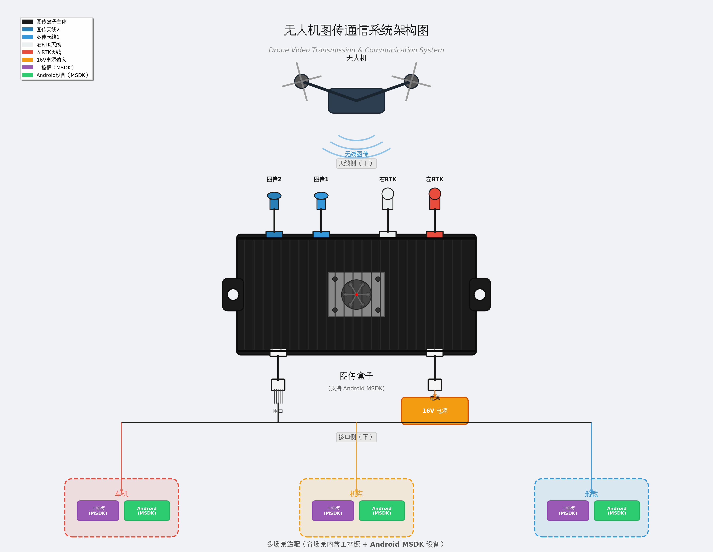

# GDU SDK for Android

## SDK 简介
GDU Android MSDK 为移动端应用提供对无人机的全面控制与数据接入能力。功能包括飞行与遥控器控制、云台与相机控制、实时高清图传、飞行状态与传感器数据回传、航线与任务管理、以及 RTK/定位与解码管理等。SDK 支持S400系列，S200系列，及多种云台与相机型号（含 8K、双光、红外等），兼容常见 Android 硬件平台，便于在巡检、应急响应、测绘与行业级场景中快速集成与二次开发。


## 版本更新记录

   [完整更新记录](https://github.com/GduDeveloper/Mobile-SDK/blob/develop_3.0/document/UPDATE_VERSION.md)

## API 文档

   [SDK_API文档](https://github.com/GduDeveloper/Mobile-SDK/blob/develop_3.0/document/MSDK_API/cn/00.MSDK_API.md)


## 集成指南
### 添加依赖
1. 将 SDK Jar 包（GduLibrary-*.aar）拷贝到 app/libs 目录。
2. 在 module 的 build.gradle 中添加：
~~~groovy
implementation fileTree(dir: 'libs', include: ['*.aar'])
sourceSets {
    main {
        jniLibs.srcDirs = ['libs']
    }
}
~~~
3. 权限与配置：在 AndroidManifest.xml 中声明相机、录音、网络与定位等所需权限，并在运行时请求授权。
4. 混淆：启用 R8/ProGuard 时，请参考 SDK 随附的混淆规则并保留 SDK 的公共 API 类。
5. 示例：建议参考 samples 或示例工程以快速完成初始化与图传显示的接入。
## 开发接口
SDK 提供一组高层 API，便于控制无人机与获取数据。主要接口包括：

- GDUSDKManager：SDK 初始化、注册与授权管理；负责设备发现、连接与生命周期管理。
- GDUAircraft：表示飞行器实体，提供对子模块（飞控、相机、云台、电池等）的访问入口。
- GDUFlightController：飞控控制接口（起飞/降落、姿态控制、任务调度）。
- GDUCamera：相机控制与媒体管理（拍照、录像、相机参数设置、视频流控制）。
- GDUGimbal：云台控制（俯仰、偏航、预设位管理等）。
- GDUBattery：电池状态查询与电量/健康告警回调。
- GDURemoteController：遥控器状态与按键事件接口。
- GDURadar：雷达/避障感知数据接口。
- GDUAirlink：图传链路、带宽与网络参数管理。
- GDUCodecManager：视频流解码与渲染管理。
- Mission：任务系统，包含 WaypointMission、FollowMe、Hotpoint 等任务类型。
- GDUDiagnostics：运行态诊断、日志与错误上报接口。

示例与调用方式详见上方的 SDK_API 文档链接。

## 使用场景
### 一、MSDK 配合图传盒子 — 机场场景
   本设备为**无人机图传 + 双 RTK 一体化接收盒子**，集成无线图传接收、双路 RTK 定位接收模块，支持 Android MSDK 对接，可对接工控板、带网口 Android 设备，适配车机、自动化机库、船载等地面 / 舰载无人机地面接收场景。

- 设备对外接口：双 RTK 天线接口（左 RTK、右 RTK）、双图传天线接口（图传 1、图传 2）；电源接口、千兆网口
- 供电：16V 直流电源输入
- 通信方式：天端与无人机无线链路通信；地端网口输出音视频、RTK 定位数据，对接上位设备
- 对接 SDK：Android MSDK

### 硬件接口说明

#### 天线侧接口（天线面板）

| 接口标签 | 接口颜色 | 功能说明 |
| :--- | :--- | :--- |
| 左 RTK | 红色 | 左路 RTK GNSS 天线，外接 RTK 定位天线 |
| 右 RTK | 米白色 | 右路 RTK GNSS 天线，外接 RTK 定位天线 |
| 图传 1 | 蓝色 | 图传接收天线 1，无人机无线图传接收链路 1 |
| 图传 2 | 蓝色 | 图传接收天线 2，无人机无线图传接收链路 2 |

&gt; 提示：天线接口为 FAKRA 接头，请勿暴力插拔；RTK 天线需要放置开阔无遮挡环境，保证卫星信号；图传天线尽量对准无人机飞行方向。

#### 有线侧接口（电源 & 网口面板）

1. **电源接口（白色线束插头）**：输入 16V DC，注意电源正负极，禁止接入超过 18V 电压，防止烧毁设备。

2. **网口接口（白色 RJ45 线束插头）**：千兆以太网口，输出图传视频流、RTK 定位原始数据、设备状态；对接**工控板 / 带网口 Android 设备**，Android 设备运行 MSDK 应用。

#### 设备散热

设备外壳为散热齿铝壳，自带微型散热风扇；使用时不要堵塞风扇开孔，设备周边预留通风空间。

### 整体通信框架



### 硬件接线步骤

&gt; ⚠️ 接线顺序：**先接所有天线 → 再接网线 → 最后接通 16V 电源；断电时先断电源，再拔天线**。禁止带电插拔天线，避免射频模块损坏。

1. **天线连接**
   1. 将左 RTK、右 RTK 定位天线分别接到盒子上左 RTK、右 RTK FAKRA 接口；
   2. 将两路图传接收天线接到图传 1、图传 2 接口；
   3. RTK 天线摆放：开阔场地，远离金属遮挡；图传天线调整方位，朝向无人机作业区域。

2. **网线连接**
   使用配套网口线束，一端接盒子网口，另一端接入 Android 网口设备或工控板网口；设置上位设备 IP，与图传盒子处于同一局域网网段。

3. **电源接入**
   将 16V 直流电源接入盒子电源插头，确认电压无误后上电；上电后风扇启动，设备开始工作。

## 软件使用说明

### Android MSDK 对接流程

1. Android 设备网口配置，与图传盒子网络互通，网络可达；
2. Android 设备部署基于 **Android-MSDK** 开发的应用；
3. MSDK 通过以太网链路和图传盒子建立通信连接；
4. 连接成功后：
   1. 获取无人机实时图传视频画面；
   2. 获取无人机飞行状态、遥控器状态；
   3. 获取双路 RTK 定位输出数据（无人机位置、地面端 RTK 定位）。

&gt; 注意：本盒子通过网口转发 MSDK 协议，不需要 USB 连接无人机，所有交互走有线以太网。

### 工控板二次开发（车机 / 机库 / 船载场景）

1. 工控板网口配置，和盒子网络连通；
2. 接收网口输出数据：
   1. 视频流：解码实时无人机图传画面；
   2. RTK 数据：解析两路 RTK 原始定位报文；
   3. 设备状态：读取盒子工作状态、信号强度、链路状态；
3. 将视频、定位数据接入上层业务系统：车载显示、机库自动化调度系统、船载监控平台。

### 使用场景说明

1. **车机地面站**：安装于作业车辆，车辆上部署工控 / Android 车机，盒子接收无人机图传与 RTK，车内实时监控无人机作业。
2. **自动化机库**：集成在无人机自动机库内部，无人机回库时，盒子持续接收图传、RTK 定位，用于机库监控、降落辅助定位。
3. **船载平台**：安装于作业船舶，海上环境接收无人机下行图传与 RTK 定位，完成海上无人机作业监控。

### 故障排查

| 现象 | 排查建议 |
| :--- | :--- |
| 上电风扇不转 | 检查 16V 电源电压，检查电源线束插头是否插紧 |
| MSDK 无法连接设备 | 确认网线完好；确认上位机 IP 和盒子在同一网段；确认无人机和盒子无线链路配对成功 |
| 无图传画面 | 检查图传天线是否接好；确认无人机机载图传开启；检查无线链路信号强度 |
| RTK 无定位 | 检查 RTK 天线安装，确认天线无遮挡；检查左 / 右 RTK 天线接口不要插混 |

### 重要安全注意事项

1. 严格使用 16V DC 供电，严禁输入其他电压，防止烧毁设备；
2. **严禁带电插拔天线**，射频口带电拔插极易损坏内部模块；
3. 设备工作风扇不要堵塞，保证散热，高温会造成链路卡顿、断连；
4. RTK 天线尽量远离大功率电源、电机等电磁干扰源；
5. 船载 / 车载震动环境使用，所有接头做好防震紧固，避免接头松动断连。

### 二、MSDK V4 适配 K05 车载机库（机巢场景）

本节介绍如何基于 **GDU Android MSDK V4**（SDK 版本号 V4.0）在车机 / 机库控制终端上适配 **普宙科技天鹰车载无人机系统 K05 系列车载机库**（K05 机库），实现无人机随车部署、移动起降、任务作业与自动返航回舱的一体化集成。

#### 产品概述

K05 车载机库安装于车辆顶部，与配套无人机组成车载无人机系统，适用于公路交通巡检、山区林地巡护监测、地表测绘、应急搜救、山林火情监测等移动作业场景：

- 模块化设计，快速拆装、即刻出发，兼容硬派越野车、SUV、轿车等多种车型；
- 支持最高 30km/h 车速下的移动起降，车辆行驶中可一键跟飞，并支持行驶中精准返航回舱；
- 支持定点绕飞、跟踪飞行、指点飞行等多种智能飞行模式；
- 云台搭载 4800 万像素广角和变焦相机，支持 10 倍连续光学变焦、160 倍混合变焦，三轴机械云台 + EIS 数字防抖联合增稳；
- 具备高精度红外感知与热成像能力，支持 RTK、通讯喊话器、4G/5G、探照灯等多元载荷；
- 多端操控、一屏掌控。

#### 系统通信架构

车机 / 机库控制终端（Android 设备）运行基于 MSDK V4 的应用，通过无线Wifi网络与K05机库及舱内无人机建立通信链路：

- 机库对外提供 WiFi（AP）、4G 网络，行业版支持有线网口；
- 车机 APP 连接机库 WiFi 后，通过蓝牙与机库对频，并在舱门关闭的状态下完成无人机对频；
- MSDK 以机巢模式发现并连接机库与无人机，经无线链路下发飞行控制、接收图传与状态数据。


#### MSDK V4 适配步骤

1. **集成 SDK V4**：将 `GduLibrary-*.aar` 及依赖库放入 libs 目录，配置 `dependencies` 与 `jniLibs.srcDirs`，声明网络、定位等所需权限。
2. **设置机巢连接场景**：注册 SDK 前将连接场景设置为机巢模式：
   ```java
   SDKManager.getInstance().setConnectScene(ConnectScene.HANGAR);
   SDKManager.getInstance().registerApp(context, callback);
   ```
3. **连接机库与无人机**：`registerApp` 成功后调用 `SDKManager.getInstance().startConnectionToProduct()` 建立连接，通过 `onProductConnect` 回调获取 `Aircraft` 实例。
4. **开启无遥控器持续中值发送**（机库场景通常无物理遥控器摇杆）：
   ```java
   aircraft.getRemoteController().setContinueSendRCControlMidValueEnable(true, callback);
   ```
   可避免飞行器起飞后误触发摇杆丢失降落或航线中断。
5. **机库控制**：通过 `aircraft.nestController`（`NestController` 机库控制组件）实现机库相关控制。
6. **起飞与任务**：调用 `flightController.startTakeoff(...)` 一键起飞；通过 Mission 模块（如 `WaypointMissionOperator`）下发航线任务。
7. **返航回舱**：调用移动精准返航或车载机库精准返航：
   ```java
   flightController.exactBack(true, callback);                                        // 移动精准返航（车载/移动平台降落）
   flightController.carNestExactBack(true, frontDis, right, topDis, returnType, callback); // 车载机库精准返航
   ```
   降落流程分为高空进近、二维码靶标视觉识别定位、精准对准降落三个阶段；发生大风或标靶遮挡异常时，系统最多自动复飞重试 3 次，仍失败则自动直飞预设备降点安全降落。


#### 注意事项

- 移动起降时车速不超过 30km/h，并保持匀速直线行驶；起降风速不超过 8m/s、飞行风速不超过 12m/s；
- 机库供电电压 24V-26V，可选 220V 交流、车载点烟器（12V）、车辆 V2L 或 12V-48V 电源转接盒供电；机库电池仅支撑舱门开 / 关，接入外接电源后机库才可为无人机充电；
- 无人机对频需在舱内且舱门关闭，未对频的无人机无法展示状态、无法通过 APP 控制；
- 车辆行驶前确认舱门已关闭（车速超 5km/h 且舱门未关闭时，机库会自动关闭舱门）；
- 机库防护等级 IP56，禁止高压水枪冲洗；大风、降雪、下雨、有雾等恶劣天气请勿飞行。

## 七、支持
   有问题可以联系dev@gdu-tech.com

