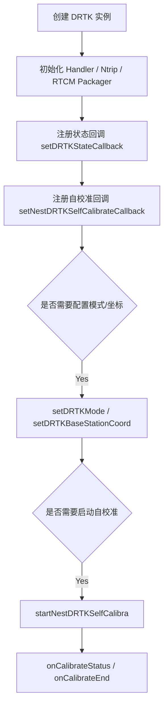

# DRTK 开发者调用文档

本文基于 `DRTK.java` 的公开 API 与内部调用链整理，面向地面站 DRTK（差分实时动态定位）开发者，说明常见调用方式与典型流程。

## 1. 适用场景

`DRTK` 主要用于地面站侧 DRTK 相关业务，包括：

- 监听 DRTK 状态回调
- 启动/停止 DRTK 自校准
- 设置/获取基站坐标
- 设置/获取 DRTK 工作模式


## 2. 公开方法一览

### 2.1 构造与注册回调

- `DRTK()`
  - 构造函数。
- `setDRTKStateCallback(DRTKStateInfo.Callback callback)`
  - 设置 DRTK 状态更新回调。
- `setNestDRTKSelfCalibrateCallback(DRTKSelfCalibrateCallback callback)`
  - 设置 DRTK 自校准状态回调。

### 2.2 自校准控制

- `startNestDRTKSelfCalibra(String ipAddress, String port, String userID, String password, String mountedPoint, CommonCallbacks.CompletionCallback callback)`
  - 启动 NTRIP 相关参数初始化，并请求底层开始自校准。
- `stopNestDRTKSelfCalibra(CommonCallbacks.CompletionCallback callback)`
  - 停止自校准。

### 2.3 基站坐标配置

- `setDRTKBaseStationCoord(DRTKBaseStationCoord coord, CommonCallbacks.CompletionCallback callback)`
  - 设置 DRTK 基站坐标。
- `getDRTKBaseStationCoord(CommonCallbacks.CompletionCallbackWith<DRTKBaseStationCoord> callback)`
  - 获取当前基站坐标。

### 2.4 模式设置

- `setDRTKMode(DRTKMode mode, CommonCallbacks.CompletionCallback callback)`
  - 设置 DRTK 模式：基准站 / 移动站。
- `getDRTKMode(CommonCallbacks.CompletionCallbackWith<DRTKMode> callback)`
  - 获取当前 DRTK 模式。

### 2.5 关联枚举

- `DRTKMode`
  - `BASE_STATION(0)`
  - `MOBILE_STATION(1)`

## 3. 关键回调对象

### 3.1 DRTKStateInfo.Callback

```java
public interface Callback {
    void onUpdate(DRTKStateInfo drtkStateInfo);
}
```

用于接收 DRTK 状态更新，包含：

- UTC 时间
- 纬度/经度
- 纬度/经度方向
- GPS 状态
- 卫星数量
- 海拔高度

### 3.2 DRTKSelfCalibrateCallback

```java
public interface DRTKSelfCalibrateCallback {
    void onCalibrateStart();
    void onCalibrateStatus(Status status);
    void onCalibrateEnd();
}
```

状态枚举包括：

- `UNKNOWN`
- `IN_PROGRESS`
- `SUCCESS`
- `FAILED`
- `RETRY_REQUIRED`

## 4. 推荐调用步骤

### 第一步：创建实例

```java
DRTK drtk = new DRTK();
```

### 第二步：注册状态回调

```java
drtk.setDRTKStateCallback(new DRTKStateInfo.Callback() {
    @Override
    public void onUpdate(DRTKStateInfo state) {
        // 展示定位信息
    }
});
```

同时可以注册自校准回调：

```java
drtk.setNestDRTKSelfCalibrateCallback(new DRTKSelfCalibrateCallback() {
    @Override
    public void onCalibrateStart() {
    }

    @Override
    public void onCalibrateStatus(Status status) {
    }

    @Override
    public void onCalibrateEnd() {
    }
});
```

### 第三步：设置 DRTK 工作模式

```java
drtk.setDRTKMode(DRTK.DRTKMode.BASE_STATION, error -> {
    if (error == null) {
        // 设置成功
    }
});
```

或：

```java
drtk.getDRTKMode(new CommonCallbacks.CompletionCallbackWith<DRTK.DRTKMode>() {
    @Override
    public void onSuccess(DRTK.DRTKMode mode) {
        // 当前模式
    }

    @Override
    public void onFailure(GDUError error) {
    }
});
```

### 第四步：配置基站坐标（必要时）

```java
DRTKBaseStationCoord coord = new DRTKBaseStationCoord();
coord.setLatitude(30.123456);
coord.setLongitude(114.123456);
coord.setAltitude(10.0f);

drtk.setDRTKBaseStationCoord(coord, error -> {
    if (error == null) {
        // 基站坐标设置成功
    }
});
```

读取当前坐标：

```java
drtk.getDRTKBaseStationCoord(new CommonCallbacks.CompletionCallbackWith<DRTKBaseStationCoord>() {
    @Override
    public void onSuccess(DRTKBaseStationCoord coord) {
    }

    @Override
    public void onFailure(GDUError error) {
    }
});
```

### 第五步：启动 DRTK 自校准（按需）

```java
drtk.startNestDRTKSelfCalibra(
        "ntrip.server.com",
        "2101",
        "user",
        "password",
        "mountpoint",
        error -> {
            if (error == null) {
                // 自校准已启动
            }
        }
);
```

### 第六步：退出时停止自校准

```java
drtk.stopNestDRTKSelfCalibra(error -> {
    if (error == null) {
        // 已停止
    }
});
```


## 6. 简易流程图



## 7. 推荐开发用法示例

```java
public class DemoDRTKActivity extends Activity {
    private DRTK drtk;

    @Override
    protected void onCreate(Bundle savedInstanceState) {
        super.onCreate(savedInstanceState);

        drtk = new DRTK();

        drtk.setDRTKStateCallback(state -> {
            if (state != null) {
                // 更新 UI：经纬度、GPS 状态、卫星数等
            }
        });

        drtk.setNestDRTKSelfCalibrateCallback(new DRTKSelfCalibrateCallback() {
            @Override
            public void onCalibrateStart() {
            }

            @Override
            public void onCalibrateStatus(Status status) {
                // 更新自校准状态
            }

            @Override
            public void onCalibrateEnd() {
            }
        });

        drtk.setDRTKMode(DRTK.DRTKMode.MOBILE_STATION, error -> {
            if (error == null) {
                DRTKBaseStationCoord coord = new DRTKBaseStationCoord();
                coord.setLatitude(30.123456);
                coord.setLongitude(114.123456);
                coord.setAltitude(10.0f);

                drtk.setDRTKBaseStationCoord(coord, baseError -> {
                    if (baseError == null) {
                        drtk.startNestDRTKSelfCalibra(
                                "ntrip.server.com",
                                "2101",
                                "user",
                                "password",
                                "mountpoint",
                                callback -> {
                                    // 自校准启动成功后可继续业务处理
                                }
                        );
                    }
                });
            }
        });
    }
}
```

## 8. 使用建议

1. 优先在创建实例后注册状态回调，确保第一时间接收 DRTK 数据。
2. 如果业务依赖自校准，建议在设置模式和基站坐标之后再启动 self-calibration。
3. 读取/设置基站坐标时，必须保证 `DRTKBaseStationCoord` 字段正确，否则底层协议解析可能失败。
4. `getDRTKMode()` / `getDRTKBaseStationCoord()` 可用于实时核验当前配置状态。
5. 若 UI 需要更新定位状态，建议在回调中切回主线程更新界面。

## 9. 总结

`DRTK` 的核心调用顺序通常如下：

```text
new DRTK()
-> setDRTKStateCallback()
-> setNestDRTKSelfCalibrateCallback()
-> setDRTKMode() / getDRTKMode()
-> setDRTKBaseStationCoord() / getDRTKBaseStationCoord()
-> startNestDRTKSelfCalibra()（按需）
-> stopNestDRTKSelfCalibra()（结束时）
```

只要按照这个顺序使用，开发者就能稳定接入 DRTK 定位状态、差分数据流与自校准流程。
